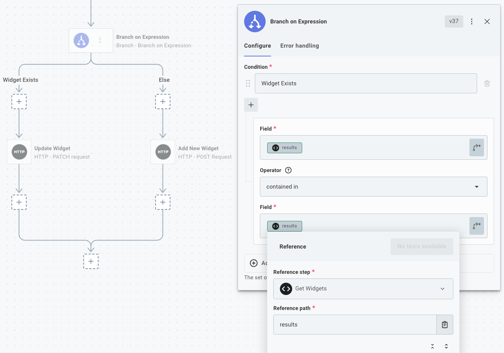

The [branch](./connectors/branch.md) tool allows you to add branching logic to your Workflow.
Think of **branches** as logical paths that your Workflow can take.
Given some information about a previous steps' results, your Workflow can follow one of many paths.

Branch steps are handy when you need to conditionally execute some steps.
Here are a couple of examples of things you can accomplish with branching:

**Example 1:** The [webhook requests](./triggering.md#universal-webhook-triggers) your Workflow receives could contain a "Widget Created", "Widget Updated" or "Widget Deleted" event.
You need to execute a series of steps depending on which event type was received.

**Example 2:** You want to [upsert](https://www.sqlite.org/lang_upsert.html) data into system that doesn't support upsert.
You can check if a record exists, and branch into "add a new record" or "update the existing record" branches depending on if the record exists.

## Branching on a value

A simple branch action branches on a **value**.
If you've done any programming, it's very similar to the `switch`/`case` construct present in many programming languages.
You declare "this step result will have one of these values - follow a branch based on which value it is."

Consider **Example 1** above.

Suppose the webhook request you receive has a HTTP header, `event` that can be one of three values: `widget-created`, `widget-updated` or `widget-deleted`.
You can look at that value and branch accordingly.


If your flow receives a `widget-created` event header, it will follow the "Created" branch, etc.

## Branching on an expression

The [Branch on Expression](./connectors/branch.md#branch-on-expression) action allows you to create branches within your integration based on more complex inputs.
You can compare step results or static values using [comparison operators](#branch-on-expression-comparison-operators) (like "does not equal" or "less than") and follow a branch based on the results of the comparisons.



### Branch on expression comparison operators

Comparison operators allow you to compare two properties to one another.
You can test if the two values are [equal](#equals), if one value is [contained](#contained-in) within the other (assuming the second value is a list), if one timestamp is [before](#is-before-datetime) another timestamp, etc.

If your comparison evaluates to `true` (for example, if you use the `equals` operator and both values are `5`), the branch associated with that comparison within your Workflow is followed.

#### Equals

The **equals** operator evaluates if two fields are equal to one another, regardless of type.

| Left Field      | Right Field     | Result  | Comments                                                       |
| --------------- | --------------- | :-----: | -------------------------------------------------------------- |
| `5.2`           | `5.2`           | `true`  |                                                                |
| `5.2`           | `5`             | `false` |                                                                |
| `"5.2"`         | `5.2`           | `true`  | Strings are cast to numbers when compared to numbers           |
| `"Hello"`       | `"Hello"`       | `true`  |                                                                |
| `"Hello"`       | `"hello"`       | `false` | String comparison is case-sensitive                            |
| `false`         | `0`             | `true`  | Boolean `false` evaluates to `0`, and `true` evaluates to `1`. |
| `[1,2,3]`       | `[1,2,3]`       | `true`  | Arrays whose elements are the same are considered equal        |
| `{"foo":"bar"}` | `{"foo":"bar"}` | `true`  | Objects with the same keys/values are equal                    |

#### Does not equal

The **does not equal** operator evaluates if two fields are _not_ equal to one another, regardless of type.

| Left Field | Right Field | Result |
| ---------- | ----------- | :----: |
| `5.3`      | `5.2`       |  true  |
| `[1,2,3]`  | `[1,2,4]`   |  true  |

#### Is greater than

The **is greater than** operator evaluates if the left field is greater than the right field, and is an implementation of the JavaScript [greater than operator](https://developer.mozilla.org/en-US/docs/Web/JavaScript/Reference/Operators/Greater_than).

| Left Field | Right Field | Result  | Comments                                                                       |
| ---------- | ----------- | :-----: | ------------------------------------------------------------------------------ |
| `5.2`      | `5.3`       | `false` |                                                                                |
| `5.3`      | `5.3`       | `false` | The values are equal; one is not greater than the other                        |
| `"5.3"`    | `5.2`       | `true`  | Strings are cast to numbers when compared to numbers                           |
| `"Hello"`  | `"World"`   | `false` | Strings are compared alphabetically - `"Hello"` does not occur after `"World"` |
| `"hello"`  | `"World"`   | `true`  | The ASCII value for `"h"` occurs [after](https://www.asciitable.com/) `"W"`    |
| `true`     | `false`     | `true`  | `true` (1) is greater than `false` (0)                                         |

#### Is greater than or equal to

The **is greater than or equal to** operator is similar to **is greater than**, but also returns true if the values being compared are equal to one another.

| Left Field | Right Field | Result | Comments                                             |
| ---------- | ----------- | :----: | ---------------------------------------------------- |
| `5.3`      | `"5.3"`     | `true` | Strings are cast to numbers when compared to numbers |

#### Is less than

The **is less than** operator evaluates if the left field is less than the right field.

| Left Field | Right Field | Result | Comments                                |
| ---------- | ----------- | :----: | --------------------------------------- |
| `3`        | `4`         | `true` |                                         |
| `"abc"`    | `"daa"`     | `true` | `"a"` is less than `"d"` alphabetically |

#### Is less than or equal to

The **is less than or equal to** operator is similar to **is less than**, but also returns true if the values being compared are equal to one another.

#### Contained in

The **contained in** operator evaluates if the value of the left field is contained in the right field.
The right field must be an array or a string.

| Left Field | Right Field       | Result  | Comments                                                          |
| ---------- | ----------------- | :-----: | ----------------------------------------------------------------- |
| `"world"`  | `"Hello, world!"` | `true`  |                                                                   |
| `"World"`  | `"Hello, world!"` | `false` | String comparison is case-sensitive                               |
| `2`        | `[1,2,3]`         | `true`  |                                                                   |
| `"2"`      | `[1,2,3]`         | `false` | The string `"2"` does not occur in the array of numbers `[1,2,3]` |

#### Not contained in

The **not contained in** operator evaluates if the value of the left field does not appear in the right field.

| Left Field | Right Field | Result  |
| ---------- | ----------- | :-----: |
| `2`        | `[1,2,3]`   | `false` |
| `'Hi'`     | `'Hello'`   | `true`  |

#### Is empty

The **is empty** operator evaluates if the given value is an empty string or an empty array.

| Field     | Result  |
| --------- | :-----: |
| `""`      | `true`  |
| `"hello"` | `false` |
| `[]`      | `true`  |
| `[1,2,3]` | `false` |

#### Exactly matches

The **exactly matches** operator evaluates if the two fields are equal to one another, taking type of the values into consideration.

| Left Field | Right Field | Result  | Comments                                        |
| ---------- | ----------- | :-----: | ----------------------------------------------- |
| `"5"`      | `5`         | `false` | The string `"5"` is not equal to the number `5` |

#### Does not exactly match

The **does not exactly match** operator evaluates if the if the two fields are not equal to one another, taking type of the values into consideration.

| Left Field | Right Field | Result | Comments                                        |
| ---------- | ----------- | :----: | ----------------------------------------------- |
| `"5"`      | `5`         | `true` | The string `"5"` is not equal to the number `5` |

#### Starts the string

The **starts the string** operator evaluates if the the right field's value begins with the left field's value.
Both right and left values must be strings.

| Left Field | Right Field         | Result  | Comments                                                               |
| ---------- | ------------------- | :-----: | ---------------------------------------------------------------------- |
| `"Test"`   | `"Testing Value"`   | `true`  |                                                                        |
| `"test"`   | `"Testing Value"`   | `false` | Comparisons are case-sensitive                                         |
| `"Test"`   | `"A Testing Value"` | `false` | The right field must start with the left value (not merely contain it) |

#### Does not start the string

The **does not start the string** operator returns the opposite of the **starts with** operator.

#### Ends the string

The **ends the string** operator evaluates if the right field ends with the left field.
Both right and left values must be strings.

| Left Field | Right Field     | Result  |
| ---------- | --------------- | :-----: |
| `orld!`    | `Hello, World!` | `true`  |
| `orld`     | `Hello, World!` | `false` |

#### Does not end the string

The **does not end the string** operator returns the opposite of the **ends with** operator.

#### Is after (date/time)

The **is after (date/time)** operator attempts to parse the left and right fields as dates, and evaluates if the left field occurs after the right field.

| Left Field                   | Right Field                  | Result  | Comments                                                                          |
| ---------------------------- | ---------------------------- | :-----: | --------------------------------------------------------------------------------- |
| `"2021-03-20"`               | `"2021-04-13"`               | `false` |                                                                                   |
| `"2021-03-20T12:50:30.105Z"` | `"2021-03-20T11:52:21.881Z"` | `true`  | When dates are equivalent, time is compared                                       |
| `"2021-03-20"`               | `1631568050`                 | `false` | `1631568050` is the UNIX epoch time for 2021-09-13, which occurs after 2021-03-05 |

> **Note: Accepted DateTime Formats**
>
> The time comparison operators accept date/times as ISO strings (like `2021-03-20` or `2021-03-20T11:52:21.881Z`), Unix epoch timestamps in milliseconds (for example, the number `1631568050` represents a time in 2021-09-13), or `Date()` JavaScript objects.

#### Is before (date/time)

The **is before (date/time)** operator attempts to parse the left and right fields as dates, and evaluates if the left field occurs before the right field.

#### Is the same (date/time)

The **is the same (date/time)** operator attempts to parse the left and right fields as dates, and evaluates if the timestamps are identical.

| Left Field                   | Right Field                  | Result  | Comments                                                                               |
| ---------------------------- | ---------------------------- | :-----: | -------------------------------------------------------------------------------------- |
| `"2021-03-20T12:50:30.105Z"` | `"2021-03-20T12:50:30.105Z"` | `true`  |                                                                                        |
| `"2021-03-20T12:50:30Z"`     | `1616244630000`              | `true`  | `1616244630` is the millisecond UNIX epoch representation of `March 20, 2021 12:50:30` |
| `"2021-03-20T12:50:30Z"`     | `"2021-03-20T12:50:31Z"`     | `false` |                                                                                        |

#### Is true

The **is true** operator evaluates if an input field is "truthy".

Common "truthy" values include `true`, `"true"`, `"True"`, `"Yes"`, `"yes"`, `"Y"` and `"y"`.

Common "falsy" values include `false`, `"false"`, `"False"`, `"No"`, `"no"`, `"N"` and `"n"` and evaluate to `false`.
Other values that evaluate to `false` are `0`, `null`, `undefined`, `NaN` and `""`.

All other values (a non-zero number, a non-empty string, any array or object, etc.) evaluates to `true`.

| Field     | Result  |
| --------- | :-----: |
| `"Yes"`   | `true`  |
| `"True"`  | `true`  |
| `[]`      | `true`  |
| `{}`      | `true`  |
| `"Hello"` | `true`  |
| `-5`      | `true`  |
| `"n"`     | `false` |
| `false`   | `false` |
| `""`      | `false` |
| `null`    | `false` |
| `0`       | `false` |

#### Is false

The **is false** operator returns the opposite of the **is true** operator.

#### Does not exist

The **does not exist** operator evaluates to `true` if the presented value is one of the following: `undefined`, `null`, `0`, `NaN`, `false` or `""`.

| Field       | Result  |
| ----------- | :-----: |
| `undefined` | `true`  |
| `NaN`       | `true`  |
| `1`         | `false` |
| `"Hello"`   | `false` |

#### Exists

The **exists** operator returns the opposite of the `does not exist` operator.

### Combining multiple comparison operators

Multiple expressions can be grouped together with **And** or **Or** clauses, which execute like programming **and** and **or** clauses.
Take, for example, this programming expression:

```txt
if ((foo > 500 and bar <= 20) or ("b" in ["a","b","c"]))
```

The same logic can be represented with a group of conditionals in a **Branch on Expression** action:


