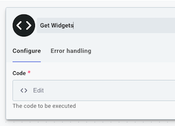
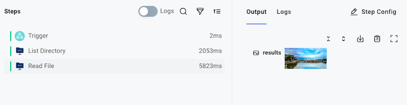

Lansweeper's Flow Builder lets you build Workflows that connect Lansweeper Platform to the other apps and services you use.
This article describes how to build Workflows.

If you have not done so yet, please first review the [Getting Started](./get-started.md) guide.

## Creating a new Workflow

To create a new Workflow, first log in to [Lansweeper Platform](https://app.lansweeper.com/).
Next, navigate to Flow Builder > Workflows.
Here, you will see all of the Workflows that you've built.

To create a new Workflow, click **+ Workflow**.

## Steps

Actions, like downloading a file from an [SFTP server](./connectors/sftp.md) or posting a message to [Slack](./connectors/slack.md), are added as Workflow **steps**.
Steps are executed in order, and results from one step can be used as inputs for subsequent steps.

Steps are run in order from top to bottom, and you can add conditional logic to your Workflow with [branching](./branching.md), or run a series of steps within a [loop](./looping.md).
If one step throws an error, your Workflow stops running until it is invoked again (though, you can decide how to [handle errors](./error-handling.md)).

### The trigger step

The first step of your Workflow is the **trigger** step, which determines when your Workflow will run.
The [triggers](./triggering.md) article details how triggers work, and how to invoke your Workflow.

### Adding steps to a Workflow

To add a step to an Workflow, click the **+** icon underneath the trigger or another action.

Select the connector and action you would like to add to your integration.
For example, you can choose the **Amazon DynamoDB** connector, and then select the **Query Items** action.


### Changing step names and descriptions

By default steps are uniquely named after the action they invoke (so, they're named things like **CSV to JSON**, or **Delete Object**).
To override that default name, click the step and open the **Details** tab in the step configuration drawer.

Like using descriptive variable names in a computer program, renaming steps allows you to give your steps descriptive names.
Rather than `HTTP - PUT` you could give your step a name like **Update Record in Acme**.
We recommend giving your steps descriptive names and descriptions so your team members can read through your Workflows and understand their purpose more readily.



## Passing data between steps

As your Workflow runs, each step generates a [step result](#step-results).
The results of one step can be fed into subsequent steps through [step inputs](#step-inputs)

### Step results

Each step in your Workflow produces a result.
For example, an [SFTP - List Directory](./connectors/sftp.md#list-directory) step will return a list of strings representing file names.


An [SFTP - Read File](./connectors/sftp.md#read-file) step will return the contents of a file that is pulled from an SFTP server (in this example, an image was fetched).



Step results take one of three forms:

- A primitive value, like a **string**, **boolean** (true/false), **number**, an **array** of primitives, or even a `null` for steps that have nothing to return.
- A [JavaScript Object](https://developer.mozilla.org/en-US/docs/Web/JavaScript/Reference/Global_Objects/Object) with several key-value pairs.

  ```json
  { "key1": "value1", "key2": ["foo", "bar", "baz"] }
  ```

  You can reference objects' keys using "dot notation".
  For example, to reference `"baz"` above, a subsequent step could reference this step's `results.key2.2` (note the `.2` references "the item at index `2` in the list").

- A **binary file**.
  Binary file outputs are objects that contain a `contentType` property (like `"image/png"`) and a `data` property containing the contents of the file in a [JavaScript Buffer](https://nodejs.org/api/buffer.html).

  ```json
  {
    "data": Buffer,
    "contentType": "application/pdf"
  }
  ```

  When viewing a binary file that can be rendered in a browser (like an image), you'll see the image in the **Output** drawer.
  If you've downloaded a different binary file type (like a PDF or MP3), you'll see it represented like `data<123456 bytes>`.

### The trigger's step result

The trigger step's result contains two major things:

1. Metadata about the execution.
   For example, your trigger's `result.invokeUrl` contains the webhook URL for your Workflow.
   The `result.startedAt` property contains the time at which the execution began.
2. The webhook request (if your Workflow was invoked via webhook), including:
   1. HTTP headers. If your webhook request included custom HTTP headers, you can reference them from your trigger's `result.headers.header-name`.
   2. Request body. `result.rawBody` contains the raw, unparsed body that was sent to your Workflow webhook URL. If you sent JSON data, the JSON will be parsed under `result.body.data`.


Other steps in your flow can reference both the metadata and webhook request data contained in your trigger's result.

### Step inputs

Each step of your Workflow requires a set of **inputs**.
An input might represent a RESTful URL to fetch data from, an ID of a Salesforce Lead to update, the name of an Amazon S3 bucket, or the contents of a file to upload.

Some inputs are required, while others are optional.

The inputs you specify can be static strings (like an Amazon S3 bucket name), a reference to a previous step's results (like a Salesforce Lead ID), or a combination of the two (like a RESTful URL that has dynamic portions).


