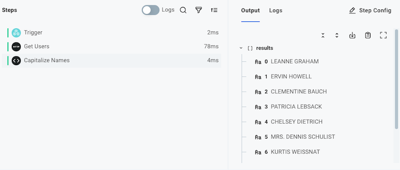

The [code](./connectors/code.md) step allows you to write short custom JavaScript functions within your Workflow.
This is helpful if you have some coding experience and would like to manipulate data with code.

## Code block structure

The code component provides a stub function by default.
Let's examine the structure of the code:

```javascript
module.exports = async (context, stepResults) => {
  return { data: null };
};
```

The code component requires you to export an asynchronous function.
The default code uses [arrow function notation](https://developer.mozilla.org/en-US/docs/Web/JavaScript/Reference/Functions/Arrow_functions) to create an `async` function to export.
If you're used to standard JavaScript function notation, this is the same as:

```javascript
async function myFunction(context, stepResults) {
  return { data: null };
}

module.exports = myFunction;
```

## Context properties

The first parameter of your function (`context`) contains metadata about the currently running execution, along with helpful functions for logging:

- `logger` allows you to write out log lines.
  See [logging](#logging) below.
- `stepId` is the ID of the current step being executed.
- `executionId` is the ID of the current execution.
- `invokeUrl` is the URL used to invoke this Workflow.
- `instance` is an object containing an `id` and `name` of your Workflow.
- `startedAt` represents the time at which the execution started, in ISO 8601 format (e.g., `2023-10-01T12:00:00Z`).

You can reference any of these context properties using JavaScript dot notation:

```javascript
module.exports = async (context, stepResults) => {
  context.logger.info(
    `This step is part of the ${context.instance.name} Workflow. ${context.executionId} started at ${context.startedAt}.`,
  );
  return { data: null };
};
```

To make code more readable, you can [destructure](https://developer.mozilla.org/en-US/docs/Web/JavaScript/Reference/Operators/Destructuring) the `context` parameter into its component parts:

```javascript
module.exports = async ({ instance, executionId, startedAt }, stepResults) => {
  context.logger.info(
    `This step is part of the ${instance.name} Workflow. ${executionId} started at ${startedAt}.`,
  );
  return { data: null };
};
```

## Logging

The `context.logger` object can be used for logging and debugging.
`context.logger` has four functions: `debug`, `info`, `warn`, and `error`.
For example:

```javascript
module.exports = async (context, stepResults) => {
  context.logger.info("Things are going great");
  context.logger.warn("Now less great...");
};

// or

module.exports = async ({ logger }, stepResults) => {
  logger.info("Hello World");
};
```

**Note**: Log lines are truncated after 4096 characters.

## Referencing previous steps' results

The second parameter of your function, `stepResults`, contains the results of all previous steps in your Workflow.

For example, if you have an **HTTP - GET** step named **Fetch Users List** that pulls down an array of users from `https://jsonplaceholder.typicode.com/users`, you can generate an array of email addresses with this code:

```javascript
module.exports = async (context, stepResults) => {
  const userArray = stepResults.fetchUsersList.results;
  const emailArray = userArray.map((user) => user.email);
  return { data: emailArray };
};
```

> **Tip: Step results are usually objects**
>
> Many components return objects that have multiple nested keys.
> So, you can reference `stepResults.myStepName.results.someKey`.
> It's rare for a component to return serialized JSON, so there's rarely need to `JSON.parse()` results from a previous step.

Step names are [camelCased](https://en.wikipedia.org/wiki/Camel_case), which means spaces and other special characters are removed from the step name, and all words except the first are capitalized.
Here are a few examples of step names, and their corresponding step result reference:

| Step name                  | Code reference                            |
| -------------------------- | ----------------------------------------- |
| `My Step Name`             | `stepResults.myStepName.results`          |
| `my step name`             | `stepResults.myStepName.results`          |
| `HTTP - GET`               | `stepResults.httpGet.results`             |
| `Fetch 🚀 rocket launches` | `stepResults.fetchRocketLaunches.results` |

## Code step return values

The code component can optionally return a value for use by a subsequent step.
The return value can be an object, string, integer, etc., and will retain its type as the value is passed to the next step.

The return value is specified using the `data` key in the return object.

In this example suppose a previous step `Get Users` returned an array of user objects.
This step will return an array of the users' names, in all caps:

```javascript
module.exports = async (context, stepResults) => {
  const users = stepResults.getUsers.results;
  const usersNames = users.map((user) => user.name.toUpperCase());
  return { data: usersNames };
};
```

The code step's result can be used as input for the next step by referencing `theCodeStepsName.results`.



## Making HTTP calls from a code step

The NodeJS [fetch](https://developer.mozilla.org/en-US/docs/Web/API/fetch) API is baked into the code component.
To make an HTTP call to an API, you can use the `fetch` function:

```javascript title="Make an HTTP POST request from a code step"
module.exports = async (context, stepResults) => {
  const response = await fetch("https://postman-echo.com/post", {
    method: "POST",
    headers: {
      Accept: "application/json",
      "Content-Type": "application/json",
      Authorization: "Bearer abc-123",
    },
    body: JSON.stringify({ foo: "bar", baz: 123 }),
  });
  const parsedData = await response.json();
  return { data: parsedData };
};
```

## Adding dependencies to a code step

If your code component depends on node modules from `npm`, dependencies will be dynamically imported from the [UNPKG](https://unpkg.com/) and [jsDelivr](https://www.jsdelivr.com/) CDNs.
For example, if your code component reads:

```javascript title="Import lodash as a dependency"
const lodash = require("lodash@4.17.21/lodash.js");

module.exports = async (context, stepResults) => {
  const mergedData = lodash.merge(
    { cpp: "12" },
    { cpp: "23" },
    { java: "23" },
    { python: "35" },
  );
  return { data: mergedData };
};
```

Then [lodash](https://unpkg.com/browse/lodash@4.17.21/lodash.js) version 4.17.21 will be imported as a dependency.

You should specify specific known working versions of `npm` packages for your code component:

```javascript
const lodash = require("lodash@2.4.2");
const { PDFDocument } = require("pdf-lib@1.17.1/dist/pdf-lib.js");
```

You can require any file from `npm` using `package[@version][/file]` syntax.
Note that with the `lodash` import above, no file was specified.
If no file is specified, the `main` file defined in the `npm` package's `package.json` is imported.
An explicit path was called out for the `pdf-lib` import because the `pdf-lib` package defaults to importing an index file that itself requires other files, and `dist/pdf-lib.js` is a completely independent file that can be imported on its own..

> **Warning: Downstream dependencies**
>
> In order for an external dependency to be compatible with a code step, all JavaScript code must be compiled into a single file.
>
> For example, [https://unpkg.com/lodash@4.17.20/lodash.js](https://unpkg.com/lodash@4.17.20/lodash.js) contains all of the code necessary to run in a single file.
> [https://app.unpkg.com/lodash@4.17.20/files/flatten.js](https://app.unpkg.com/lodash@4.17.20/files/flatten.js) does not - it has its own `require()` statement and depends on other files.
> The former would work in the code step, the latter would not.
>
> If the external package has its own dependencies that are not compiled in, or if the file that you loaded has its own `require()` statements, you will see errors.

### Requiring built-in NodeJS modules

You can also require built-in NodeJS modules, like `crypto` or `path`.
If the library you specify is built in to NodeJS, the client will _not_ reach out to a CDN, and will instead use the built-in module.

```javascript
const crypto = require("crypto");

module.exports = async () => {
  const { publicKey, privateKey } = crypto.generateKeyPairSync("rsa", {
    modulusLength: 4096,
    publicKeyEncoding: {
      type: "spki",
      format: "pem",
    },
    privateKeyEncoding: {
      type: "pkcs8",
      format: "pem",
      cipher: "aes-256-cbc",
      passphrase: "top secret",
    },
  });

  return {
    data: {
      publicKey,
      privateKey,
    },
  };
};
```
