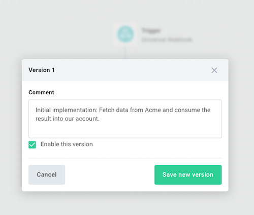

Your Workflow has two copies: the draft copy that you build and test in the Flow Builder, and the production copy that runs when your Workflow is enabled.

At any point as you [test](./testing.md) your Workflow you can save a draft copy of your Workflow by clicking the **Save draft** button.
Clicking this button will not affect your production copy.

Once you are satisfied with testing and your Workflow works as expected, you can enable the production copy by first clicking the arrow to the right of **Save draft** and then selecting **Save as new version**.
Give your version a comment (what you changed), and optionally select **Enable this version**.

Alternatively, you can enable your Workflow by clicking the **Enable** button on the top left of the canvas.

Enabling your Workflow has the following effects:

- It makes a production-ready copy of your Workflow.
  Any changes you make to the Workflow after enabling it will not affect the production copy unless you explicitly save a new version and enable it.
- If your workflow uses a [schedule trigger](./triggering.md#schedule-triggers), it will start running on the schedule you defined.
- If your workflow uses a [webhook trigger](./triggering.md#universal-webhook-triggers), it will start listening for incoming webhook requests using its production URL.
