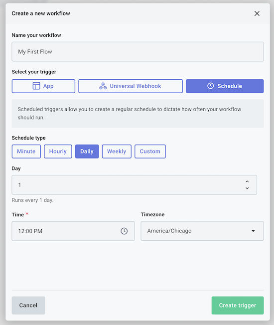
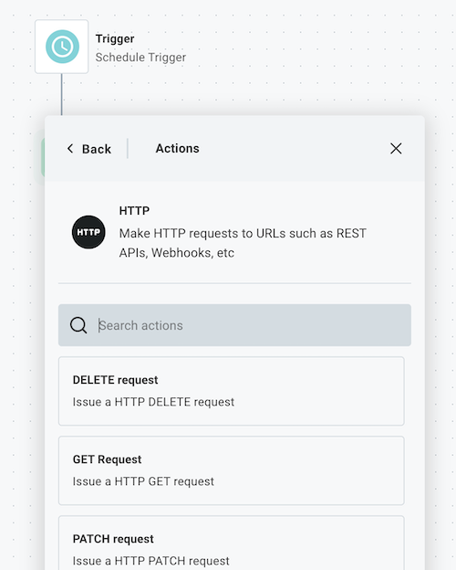
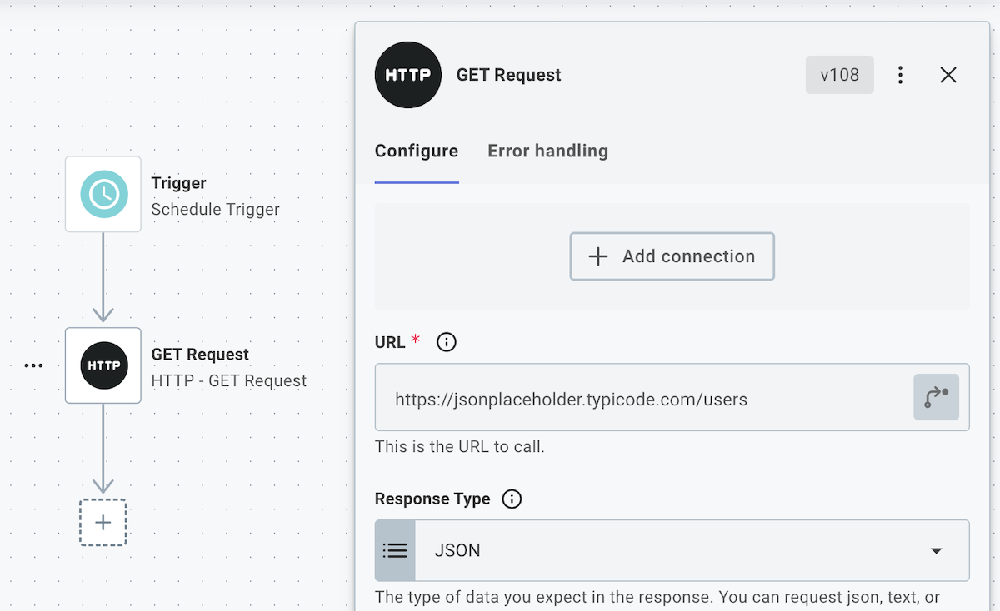
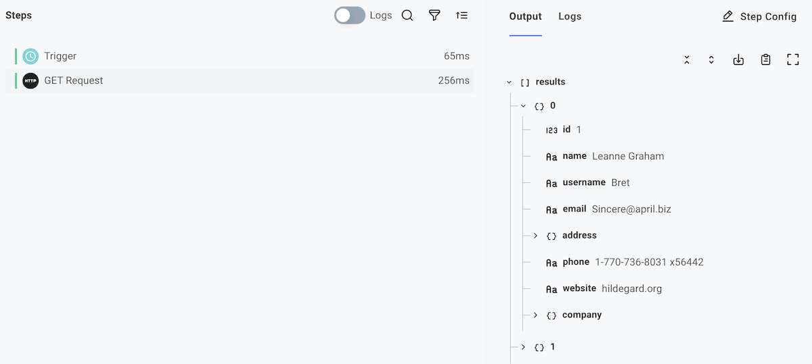
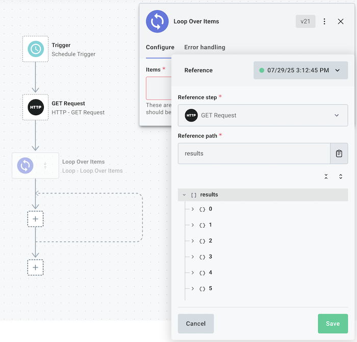
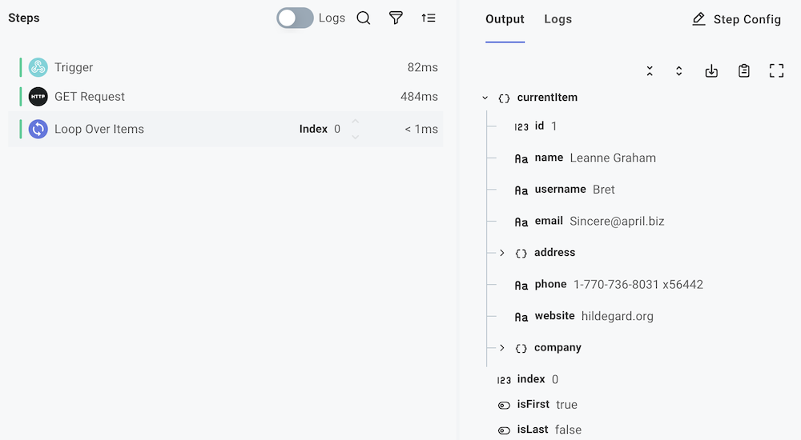
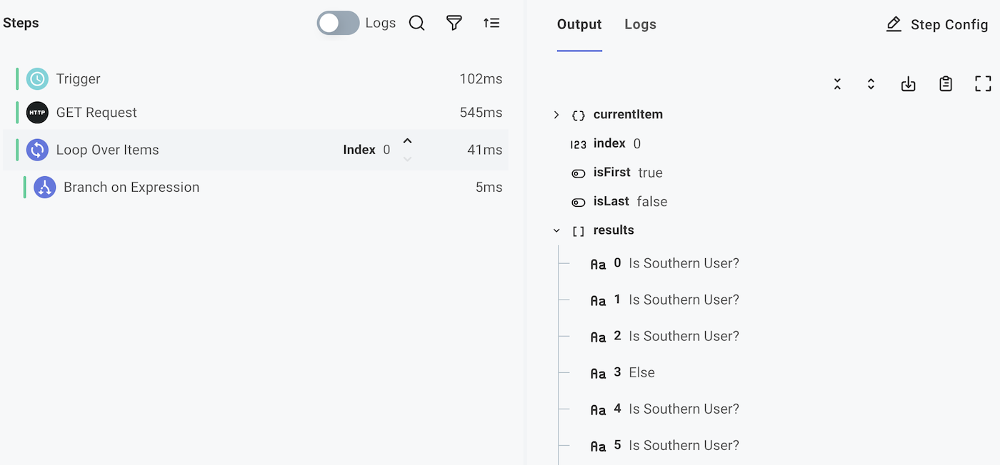
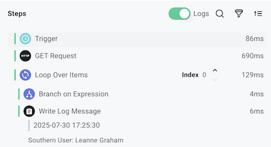

## Overview

This tutorial will walk you through some basic concepts of Workflow development using the Lansweeper's Flow Builder.

- Fetch user data from an API
- Learn how data flows between steps of a Workflow
- Use a loop to iterate over the users you fetch
- Use logical branches to make decisions based on user properties
- Take different actions based on user characteristics

## Workflow overview

The Workflow you build here will fetch a list of users from an API, loop over each user, check if they're from a specific geographic region (south or north of the equator), and take different actions based on their location.

We'll use the JSONPlaceholder API `https://jsonplaceholder.typicode.com/users`, which provides fake user data.

## Start building

We'll start by creating a new Workflow.
Log in to [Lansweeper Platform](https://app.lansweeper.com/), then navigate to Flow Builder > Workflows.

Create a new Workflow by clicking **+ Workflow**.

### Configure the Workflow trigger

This Workflow will run on a schedule.
When prompted, select **Schedule** under **select your trigger** and then configure your Workflow to run on a daily basis at a time of your choosing.

**Note**: Your schedule trigger will be active once you finish building and [enable](./enabling.md) your Workflow.
For now, you can test your workflow as you build it by clicking the **Run** button on the bottom left of the canvas.

### Fetch user data from an API

Next, add a new step to your Workflow by clicking the **+** button below your trigger.
Search for the **HTTP** connector and add a **GET Request** step.

Rename the step to **Get Users**.
Configure your step to fetch user data from the JSONPlaceholder API.
JSONPlaceholder does not require authentication, so no **connection** is required.
In the **URL** field, enter: `https://jsonplaceholder.typicode.com/users`

Click the green **Test** button to test your Workflow so far.
If you select the **Get Users** step in your test results, you will see the user data that was fetched from the API in the **Output** tab.

### Loop over the users

Now that we're fetching a list of users, we need to loop over each user to process their information.
Add another step under your **Get Users** step, this time searching for the **Loop** > **Loop Over Items** action.

Name your step **Loop Over Users**.
Configure your loop step to iterate over the user data from the previous step.
In the **Items** field, click **Configure Reference** and select the `data` property (or `body` property) of the **Get Request** step.

Run a test of your Workflow again.
This time, you'll see that the loop step has a **currentItem** property in its output that contains the data for the current user being processed.
We'll use this property in the next step to check the user's location.

### Branch based on user's location

Now that we're looping over each user, we need to check their address to see if they're from a specific region.
Looking at the user data, each user has an `address` object with a `geo` property containing latitude and longitude coordinates.
We'll use the latitude to determine if they live south of the equator (latitude < 0).

Add a step within your loop, this time selecting **Branch** > **Branch on Expression**.
Name the step **Check User Location**.

Configure the branch step to have a condition called **Is Southern User?**.
In the **Field** input, click **Configure Reference** and select the loop step's **currentItem.address.geo.lat** property.
Under **Operator** select **is less than**.
In the **Value** field, enter `0`.

Now, users with latitude less than 0 (southern hemisphere) will follow the **Is Southern User?** branch, while users from the northern hemisphere will follow the **Else** branch.

If we run our Workflow once more and look at our **Loop Over Users** step again, we can see that the branch step followed the **Is Southern User?** branch for the first three items, then the **Else** branch once, etc.

### Handle users in each branch

Under the **Is Southern User?** branch, add a **log** step.
Create a friendly log message announcing the user by name.
You can reference the user's name from the loop step's `currentItem.name`.

Add a similar log step to your **Else** branch.

If you toggle **Logs** on in the test runner drawer and increment the **Index** of your loop step, you can view the log message that each loop iteration yielded.

## Next steps

Congratulations! You created your first Workflow!
While a little contrived, this Workflow demonstrates how to fetch data from a third-party, loop over lists of records, and using branching logic.

Here are a few things you should try next:

- **Modify the branching logic**: Try branching on different user properties like company name, email domain, or website.
- **Add external actions**: Instead of just logging, [send emails](./connectors/sendgrid.md#send-email) to users, create records in a [database](./connectors/postgres.md#query), or post to a chat system like [Slack](./connectors/slack.md#post-message).
- **Add more complex processing**: Parse user data and validate email formats using a [code](./custom-code.md) step, or enrich user information with additional API calls.
- **Add error handling**: Use [step-level error handling](./error-handling.md#step-level-error-handling) to handle potential errors gracefully.
