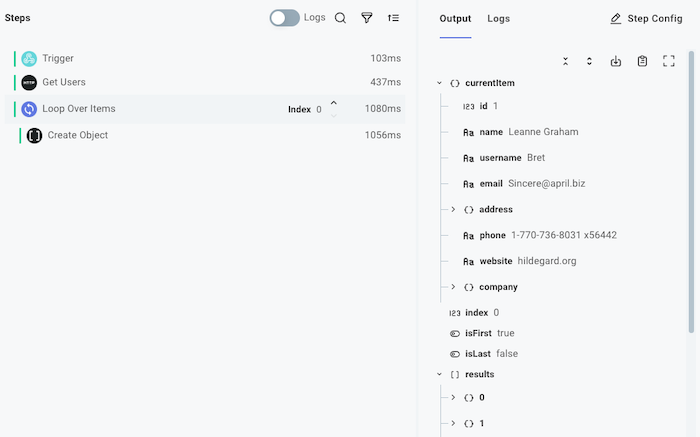
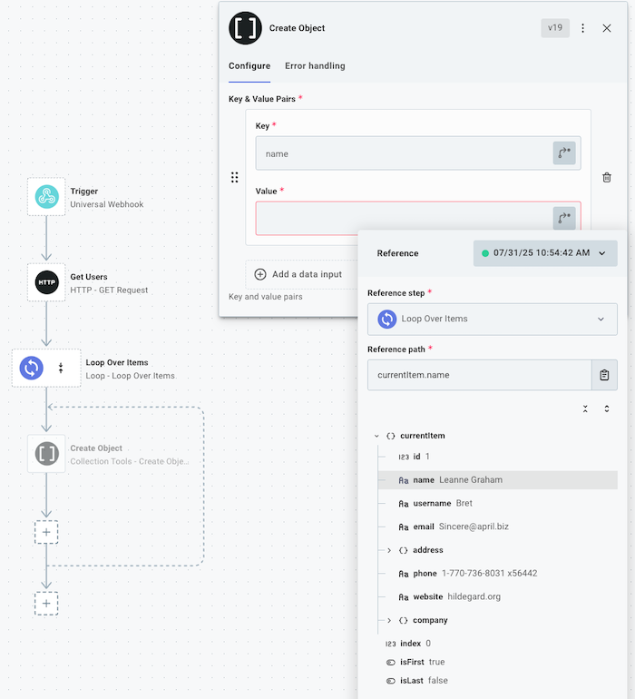

For many Workflows it's handy to be able to loop over an array of items, or to loop a certain number of times.
If your Workflow processes files on an SFTP server, for example, you might want to loop over an array of files on the server.
If your Workflow sends alerts to users, you might want to loop over an array of users.

The [loop](./connectors/loop.md) connector allows you to loop over an array of items, or you can loop a predetermined number of times.
After adding a **loop** step to your integration, you can then add steps within the loop that will execute over and over again.

## Looping over arrays of records

Imagine you have a step that returns an array of records:

```json title="Result of 'List Contacts' step"
[
  { "first": "John", "last": "Doe", "country": "US" },
  { "first": "Lisa", "last": "Nguyen", "country": "AUS" },
  { "first": "Sarah", "last": "Smith", "country": "GB" }
]
```

A loop step can then be configured to loop over those record by referencing the `results` of the **List Contacts** step:



If you're familiar with JavaScript programming, this is similar to running

```js
for (const record of records) {
  doThing(record);
}
```

The loop step provides two properties to steps within the loop:

- `currentItem` represents the item in the array that is currently being processed
- `index` represents the [zero-indexed](https://en.wikipedia.org/wiki/Zero-based_numbering) index of the current value.

Using the example above, during the second loop cycle `currentItem` would equal `{ "first": "Lisa", "last": "Nguyen", "country": "AUS" }` and `index` would equal `1`.

If you would like to use values of the current item, you can reference things like `currentItem.country` in the example above as an input for a step.



If you use a [code step](./custom-code.md) within a loop, you can reference `currentItem` and `index` like this:

```js title="Example code step referencing a loop's current item"
module.exports = async (
  { logger },
  { loopOverContacts: { currentItem, index } },
) => {
  logger.info(
    `User #${index + 1}: ${currentItem.first} ${currentItem.last} from ${currentItem.country}`,
  );
};
```

## Looping a certain number of times

Sometimes you'll want to loop a set number of times.
For those situations, a [loop N times](./connectors/loop.md#loop-n-times) action can help.

Programmatically, the **Loop N Times** action is similar to a `for` loop like this:

```js
for (let index = 0; index < SOME_NUMBER; index++) {
  doThing(index);
}
```

Like [looping over arrays](#looping-over-arrays-of-records), **Loop N Times** provides a `currentItem` and `index`, which both represent the same thing (a [zero-indexed](https://en.wikipedia.org/wiki/Zero-based_numbering) count of the current loop iteration.
So, the first loop iteration `index` will be `0`, the second iteration will have an `index` of `1`, etc.

## Return values of loops

A loop will collect the results of the **last** step within the loop, and will save those results as an array.

For example, if the last step of a loop returns a string like this:

```javascript
module.exports = async(context, loopOverContacts: { currentItem }) => {
    return {data: `Processed ${currentItem.first} from ${currentItem.country}`}
}
```

Then the `result` of the loop will yield:

```json
["Processed John from US", "Processed Lisa from AUS", "Processed Sarah from GB"]
```
