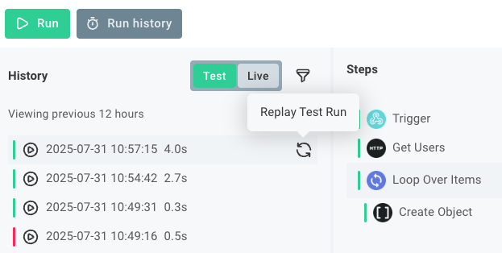

As you build your Workflow you can test it to ensure that it works as expected.
This article describes how to test your Workflow within the Flow Builder.

## The test runner drawer

The test runner drawer appears on the bottom of the Flow Builder when you click **Test** or **Test Runs**.
Within the drawer, you can see the results of test runs of your Workflow (both runs triggered by the **Test** button and runs triggered by a [webhook request](./triggering.md#what-is-a-webhook)).

## Running a test of your Workflow

To run a test of your Workflow, click the **Test** button in the bottom of the Flow Builder.
This will open the test runner drawer and start a new test run of your Workflow.
You can also click the **Test Runs** button to open the test runner drawer without starting a new test run.

### Running a test with a webhook request

If your Workflow is triggered by a webhook request, you can run a test with a test payload one of two ways:

<!-- TODO: Replace this with information about where to find test webhook URLs in the workflow builder -->>

1. Identify your test Workflow webhook URL by clicking the **Trigger** step and copying the URL from the **Webhook URL** field in the step's properties.
   Then, use a tool like [Postman](https://www.postman.com/) or [cURL](https://curl.se/) to send a POST request to that URL with a test payload.
2. Click the **Test Payload** button in the bottom of the Flow Builder and specify a payload.
   The next time you click the **Test** button, the test run will use that payload as the webhook request.

## Test run results and logs

You can observe the results of your test runs in the test runner drawer.
Select a test run and then select a step of your Workflow to see the results of that step.
You can also see the logs for each step, which can help you debug any issues that arise during the test run.

## Replaying test invocations

If your Workflow relies on data sent from a third-party service, you can replay a test invocation to simulate the same data being sent again.
That way, you don't have to configure the third-party service to send the data again, and you can test how your modified Workflow handles that same payload.

Mouse over the test invocation you'd like to replay and click the circular **Replay Test Run** arrow icon that appears.

