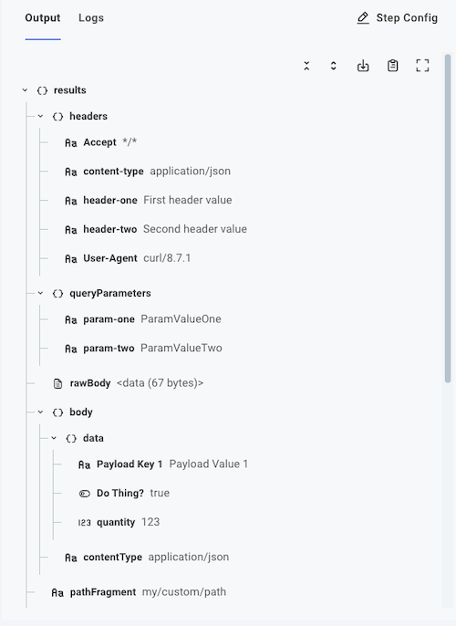
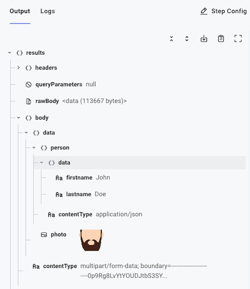

Triggers allow you to define when a Workflow should run. In the Flow Builder, you can set up various types of triggers to initiate your workflows based on different events or conditions.

If you would like your Workflow to run on a consistent schedule, you can use a [schedule trigger](#schedule-triggers).
If you want your Workflow to run in response to an event in another app, you can use an [app event trigger](#app-event-triggers).
If you want your Workflow to run in response to a webhook request, you can use a [universal webhook trigger](#universal-webhook-triggers).

## Selecting a trigger type

When you [create a new Workflow](./building.md) in the Flow Builder, you will be prompted to select a trigger type.
If you'd like to change the trigger type of an existing Workflow, you can do so by clicking on menu to the left of the trigger at the top of the Workflow editor, and selecting **Change step action**.

## Schedule triggers

Scheduled triggers allow you to run your Workflow on a regular cadence (like "every 5 minutes" or "Mondays at 8:00 AM CST").
This is useful if you have an Workflow that should be triggered consistently at a specific time.

To configure a schedule, click the trigger at the top of the Workflow editor, and open the **Configure** drawer on the right side of the screen.
You can then select the frequency of the trigger, such as "every 5 minutes", "every hour", or "every day at a specific time".


> **Tip: Use Cron expressions for advanced scheduling**
>
> You can also set up more complex schedules using [cron expressions](https://en.wikipedia.org/wiki/Cron#CRON_expression) to specify exactly when the Workflow should run by selecting **Custom** as your **Schedule type**.
> For example, a custom schedule of `*/5 8-16 * * 1-5` would cause your Workflow to run every five minutes during business hours (8:00-16:55), Monday through Friday.
> For help computing a cron schedule, see this [Cron Calculator](https://crontab.guru/).

## App event triggers

App event triggers run when some data changes in a third-party app.
For example, you may want to be notified when an [Asana Project](./connectors/asana.md#workspace-projects-trigger) is created, updated or deleted, or when a [PagerDuty Incident](./connectors/pagerduty.md#incidents-trigger) occurs.

If the connector you're working with does not have a built-in app event trigger, you can leverage the [universal webhook trigger](#universal-webhook-triggers) to receive event notifications from a third-party app or the [schedule trigger](#schedule-triggers) to periodically check for updates from the third-party.

### App event triggers with webhooks

Some connectors support app event triggers that are powered by webhooks.
These triggers allow your Workflow to run in response to events in the third-party app without needing to poll for updates.

Webhooks are configured automatically when you [enable](./enabling.md) your workflow in the Flow Builder.
When you enable your Workflow, the runner will automatically create a webhook in the third-party app to listen for events.
When an event occurs, the third-party app will send a request to your Workflow's webhook URL, triggering the Workflow to run.

### App event triggers with polling

Some apps do not support webhooks, or webhooks configuration is tedious to configure.
Polling triggers are handy when you want to be notified when data changes in those apps.

A polling trigger will poll an external API on a schedule that you set (for example, "every 5 minutes"), and if new data is available since the last time it polled, a full execution will run so your flow can process the data.

If you'd lke to listen for new records in a PostgreSQL database, for example, you can use the [PostgreSQL Polling Trigger](./connectors/postgres.md#triggers) to poll the database for new records every few minutes.

## Universal webhook triggers

The universal webhook trigger allows you to run your Workflow in response to a webhook request from any third-party application that supports webhooks.
This is useful if you want to receive real-time notifications from an application whose connector does not have a built-in app event trigger in the Flow Builder.

### What is a webhook?

A **webhook** is an automated message that is sent from one application to another application when certain events occur.
Webhooks let applications notify one another in real-time when something has changed in one system and can be used to trigger a Workflow so the change is reflected in the other system.

A webhook consists of two main parts:

- The **event** that causes the webhook to fire.
  The event is usually a change to a record in an application.
  For example, you may have a `contact.changed` or `report.created` event.
- The **endpoint** where information about the event is sent.
  The endpoint is a URL that you provide to the application that will receive the webhook.

### Your Workflow's webhook URL

Your Workflow has two URLs:

1. A test URL you can use to test your webhook configuration within the Flow Builder.
2. A production URL that is used when your Workflow is enabled and running in production.

<!-- TODO: Replace this with information about where to find test webhook URLs in the workflow builder -->>

Your Workflows URLs will each be unique and will look similar to `https://hooks.integrations.acme.com/trigger/SW5zEXAMPLE1234567890`

### Webhook request payloads

When a webhook fires, the application where the event occurred will generally send a POST request to the endpoint you provided.
Most applications will send a JSON payload in the request body that contains information about the event that occurred (though some, notably [Salesforce](./connectors/salesforce.md), send XML payloads).

Some payloads contain the entire record that changed, while others contain only the record's ID and you are expected to fetch the record yourself.

To test a webhook request, you can use the test URL in the Flow Builder to send a sample payload using an HTTP client like [Postman](https://www.postman.com/) or [cURL](https://curl.se/).

#### Posting data to a webhook URL

Data are typically sent as a JSON object in the request body of the webhook request, though the universal webhook trigger also parses data from the following sources:

- The **request body** - the JSON (or other) data that is sent to the webhook as an [HTTP request body](https://developer.mozilla.org/en-US/docs/Web/HTTP/Messages#body).
- The **request headers** - the [HTTP headers](https://developer.mozilla.org/en-US/docs/Web/HTTP/Messages#headers).
- The **URL path** - The [path to resource](https://developer.mozilla.org/en-US/docs/Learn/Common_questions/What_is_a_URL#path_to_resource) that follows the Workflow webhook URL.
- The **URL parameters** - The [parameters](https://developer.mozilla.org/en-US/docs/Learn/Common_questions/What_is_a_URL#parameters) that follow the `?` in a URL..

Take, for example, this `curl` invocation:

```bash
curl \
  'https://hooks.integrations.acme.com/trigger/SW5zEXAMPLE1234567890/my/custom/path?param-one=ParamValueOne&param-two=ParamValueTwo' \
  --header "header-one: First header value" \
  --header "header-two: Second header value" \
  --header "Content-Type: application/json" \
  --data '{"Payload Key 1":"Payload Value 1","Do Thing?":true,"quantity":123}'
```

- The request body - `{"Payload Key 1":"Payload Value 1","Do Thing?":true,"quantity":123}` - is parsed (if JSON) and is accessible to the Workflow by referencing the trigger's `results.body.data.KEY-NAME`. Non-JSON payloads (like XML, images, etc) are accessible through `results.rawBody` and can be parsed in subsequent steps that handle that type of data.
- The request headers are accessible through the trigger's `results.headers.HEADER-NAME`.
- The url path - `my/custom/path` - is accessible through the trigger's `results.pathFragment`. You can pass that data into the built-in [split string](./connectors/text-manipulation.md#split-string) action and split on the `/` character to split the URL path into an array `['my','custom','path']`.
- The url parameters - `?param-one=ParamValueOne&param-two=ParamValueTwo` are parsed and accessible through the trigger's `results.queryParameters.PARAMETER-NAME`.



#### Posting binary webhook data

If you have binary data (like an image or PDF) that you would like to post as part of your webhook invocation, you can pass that binary data in as part of your request.
For example, if you have an image, `my-image.png`, you could invoke a test of an Workflow with:

```bash
curl 'https://hooks.integrations.acme.com/trigger/SW5zEXAMPLE1234567890' \
  --request POST \
  --header 'Content-Type: image/png' \
  --data-binary '@/path/to/my-image.png'
```

The binary file can be accessed by subsequent steps by referencing `trigger.results.body.data`.

#### Posting multipart webhook data

It's useful to be able to post a combination of binary and text data to a Workflow.
For example, you might want to post information about a person, as well as an avatar image of the person, to be processed by an Workflow.
To do that, use a content type of `multipart/form-data` with your webhook invocation:

```bash
curl 'https://hooks.integrations.acme.com/trigger/SW5zEXAMPLE1234567890' \
  --request POST \
  --header "Content-Type: multipart/form-data" \
  --form person='{"firstname":"John","lastname":"Doe"};type=application/json' \
  --form photo=@johndoe.png
```

The first name in this example is accessible by referencing the trigger's `results.body.data.person.data.firstname`, and the avatar image is accessible by referencing `results.body.data.photo`.



### Webhook security

Webhooks are often secured using Hashed Message Authentication Codes (or HMAC) to ensure that the request is coming from an expected source.
You can use the [Hash](./connectors/hash.md#hmac-webhook-trigger) connector's HMAC trigger to implement HMAC security for your webhook requests.
This trigger will reject any request that is not properly signed with the expected HMAC signature.

### Synchronous and asynchronous invocations

Workflows are configured by default to run **asynchronously**.
That means that an external app makes a request to a Workflow webhook URL, but does not wait around for the Workflow to finish running.

Sometimes, though, it's handy for an application to get information back from the Workflow that was invoked.
In that case, you can choose to run your Workflow **synchronously**.

When a Workflow is invoked synchronously, the external application makes a request to the Workflow's webhook URL and waits for the Workflow to finish running before receiving a response.
The caller receives an HTTP response with the results of the _last step_ of the Workflow.

#### Default asynchronous webhook responses

By default, a Workflow runs **asynchronously** and its webhook triggers provides an HTTP code 200 ("OK") response to callers.
The body of the response contains the ID of the execution that was triggered.
Your request and response might look something like this:

```text
curl \
  --data '{}' \
  --header "Content-Type: application/json" \
  'https://hooks.integrations.acme.com/trigger/SW5zEXAMPLE1234567890'

{"executionId":"SW5zdGFuY2VFeGVjdXRpb25SZXN1bHQ6OTdiNWQxYmEtZGUyZi00ZDY4LWIyMTgtMDFlZGMwMTQxNTM5"}
```

#### Custom HTTP responses for asynchronous webhook requests

If you would like to provide a different HTTP status code in response to a webhook request, you have two options:

1. If you'd like to provide a consistent HTTP status code for all asynchronous webhook requests, you can configure the default response code in the Flow Builder by clicking on the trigger at the top of the Workflow editor, and opening the **Configure** drawer on the right side of the screen.

   

   You can similarly provide a static text response body and response headers within the universal webhook trigger configuration drawer.

2. If you'd like to provide a dynamic HTTP response dependent on the request, you can write some custom JavaScript code using a [Code Block Trigger](./connectors/code.md#code-block-trigger).

   ```javascript title="Custom JavaScript code for a trigger"
   module.exports = async ({ logger, configVars }, payload) => {
     let response = {};

     if (payload.body.data.quantity > 0) {
       response = {
         statusCode: 201,
         contentType: "application/json",
         body: JSON.stringify({ status: "Created" }),
       };
     } else {
       response = {
         statusCode: 400,
         contentType: "application/json",
         body: JSON.stringify({ error: "Quantity must be positive" }),
       };
     }

     return { payload, response };
   };
   ```

   In this example, the response will be a 201 ("Created") status code if the `quantity` in the request body is greater than 0, or a 400 ("Bad Request") status code if it is not.
   The response body will contain a JSON object with a `status` or `error` message.

#### HTTP responses for synchronous invocations

When a Workflow is invoked **synchronously**, the external application waits for the Workflow to finish running before receiving a response.
The response will contain the results of the _last step_ of the Workflow, usually in the form of a JSON object.

If you would like to return a custom HTTP status code, response body, or response headers, you can do so by using a [Code Block](./connectors/code.md#code-block) step at the end of your Workflow.

```javascript
module.exports = async (context, stepResults) => {
  return {
    statusCode: 202,
    contentType: "application/json",
    headers: { "X-Custom-Header": "foo" },
    body: JSON.stringify({ message: "Workflow completed successfully" }),
  };
};
```

Read more about [using code blocks](./custom-code.md).
