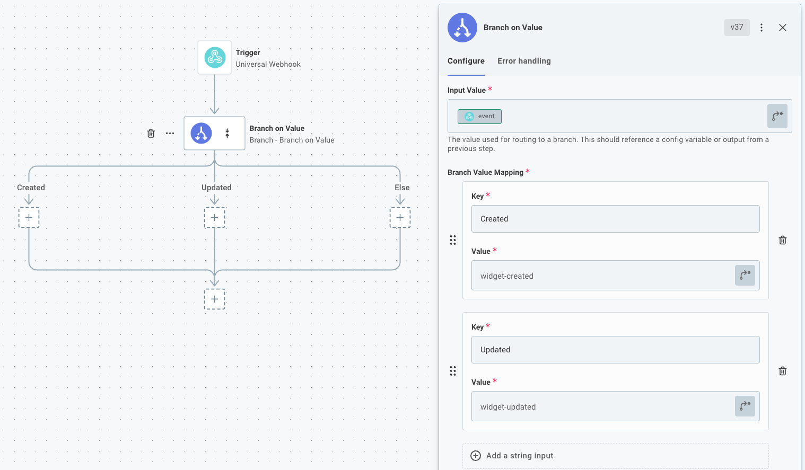

The [branch](./connectors/branch.md) tool allows you to add branching logic to your %WORKFLOW%.
Think of **branches** as logical paths that your %WORKFLOW% can take.
Given some information about a previous steps' results, your %WORKFLOW% can follow one of many paths.

Branch steps are handy when you need to conditionally execute some steps.
Here are a couple of examples of things you can accomplish with branching:

**Example 1:** The [webhook requests](./triggering.md#webhooks) your %WORKFLOW% receives could contain a "Widget Created", "Widget Updated" or "Widget Deleted" event.
You need to execute a series of steps depending on which event type was received.

**Example 2:** You want to [upsert](<https://en.wikipedia.org/wiki/Merge_(SQL)>) data into system that doesn't support upsert.
You can check if a record exists, and branch into "add a new record" or "update the existing record" branches depending on if the record exists.

## Branching on a value

A simple branch action branches on a **value**.
If you've done any programming, it's very similar to the `switch`/`case` construct present in many programming languages.

Consider **Example 1** above.

Suppose the webhook request you receive has a HTTP header, `event` that can be one of three values: `widget-created`, `widget-updated` or `widget-deleted`.
You can look at that value and branch accordingly.

If your flow receives a `widget-created` event header, it will follow the "Created" branch, etc.

## Branching on an expression

TODO

## Branch on expression operators

TODO

### Equals branch

TODO

### Does not equal branch

TODO

### Is greater than branch

TODO

### Is greater than or equal to branch

TODO

### Is less than branch

TODO

### Is less than or equal to branch

TODO

### Contained in branch

TODO

### Not contained in branch

TODO

### Is empty branch

TODO

### Exactly matches branch

TODO

### Does not exactly match branch

TODO

### Starts the string branch

TODO

### Does not start the string branch

TODO

### Ends the string branch

TODO

### Does not end the string branch

TODO

### Is after (date/time) branch

TODO

### Is before (date/time) branch

TODO

### Is the same (date/time) branch

TODO

### Is true branch

TODO

### Is false branch

TODO

### Does not exist branch

TODO

### Exists branch

TODO

## Combining multiple comparison operators

TODO

## Converging branches

TODO
