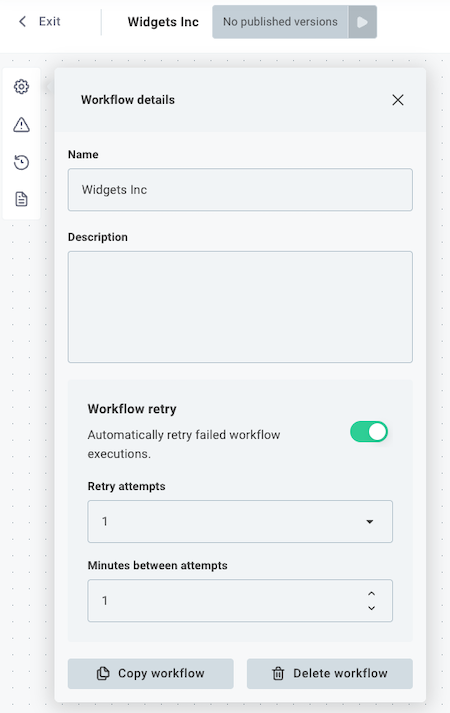
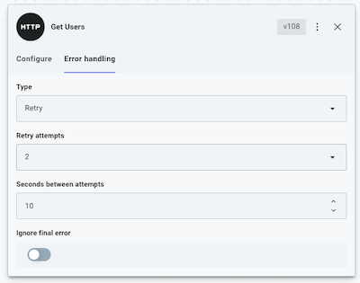

Errors happen.
An API you pull data from may encounter a temporary outage, or the "eventually" part of an "eventually consistent" database may need a couple more seconds to save a record.
When you encounter errors, you have two tools to handle them:

1. %WORKFLOW%-level error handling
2. Step-level error handling

## %WORKFLOW%-level error handling

If an execution fails, you can have the runner automatically retry a few minutes later.
The webhook payload you received will be passed back through your %WORKFLOW% again, and your %WORKFLOW% will start again at its first step.
This is useful if your %WORKFLOW% is [idempotent](https://en.wikipedia.org/wiki/Idempotence) and you don't know which step might fail.

To configure automatic retry, select the gear icon (%WORKFLOW% Details button) on the left side of the canvas, and then select **Configure %WORKFLOW% retry**.
You can configure your %WORKFLOW% to retry a certain number of times, waiting a specified number of minutes between retries.

## Step-level error handling

You might not want your entire %WORKFLOW% to stop because one step failed, especially if you're looping over hundreds of items and one item has issues.

You can configure how the runner should handle errors on each step.
To do that, click a step that you would like to configure, and then open the **Error Handling** tab in the step configuration drawer.

Under **Error Handler Type** you have three options:

- **Fail** - stop the %WORKFLOW% and throw an error.
- **Ignore** - ignore the error and continue running the remaining steps.
- **Retry** - wait for an amount of time (**Seconds between attempts**) and then try the step again, a maximum of **Retry attempts** times.
  If the last attempt still fails, either fail the %WORKFLOW% or ignore the error depending on whether **Ignore Final Error** is true or false.
