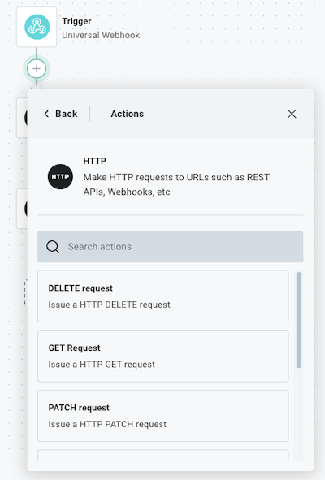

Connectors are the building blocks of your %WORKFLOW% and allow you to connect to third-party apps and services.
If you want to send data to an app that doesn't have a built-in connector, you can use the generic [HTTP Connector](./connectors/http.md) to make HTTP requests to that app's API.

> **Tip: Use raw request actions for built-in connectors**
>
> If you are integrating with an app that has a built-in connector, but you need to access an endpoint that does not have a dedicated action, you can generally use the connector's "Raw Request" action to send an authenticated request to that app.
> Most built-in connectors contain a "Raw Request" action, like [Slack](./connectors/slack.md#raw-request), [Hubspot](./connectors/hubspot.md#raw-request), etc.

## HTTP verbs

HTTP requests can use different HTTP verbs to indicate the type of action being performed. The most common verbs are:

- `GET`: Retrieve data from the server.
- `POST`: Send data to the server, often creating a new resource.
- `PUT`: Update an existing resource on the server.
- `PATCH`: Partially update an existing resource on the server.
- `DELETE`: Remove a resource from the server.

Generally, you will use `GET` for retrieving data and `POST` for sending data to an API. However, the specific verb you use will depend on the API's design and the action you want to perform.

To add an HTTP request to your workflow, search for the [HTTP](./connectors/http.md) connector and then select the HTTP verb you want to use.



## Authenticating HTTP requests

The [HTTP connector](./connectors/http.md#connections) supports several authentication methods to securely connect to APIs (like OAuth 2.0, API key bearer token, basic auth, etc).
If you click **+ Add connection** to your HTTP request step, you can select the authentication method you want to use.

If the API you're connecting to requires custom authentication (for example, it requires an `x-acme-api-key` header), you can provide that authentication header as a **Headers** input - specify the name of the header as the **Key**, and your API key as the **Value**.

## Sending data to an API using the HTTP connector

Some HTTP verbs (`POST`, `PUT`, `PATCH`) allow you to send a request body to an API, which is often required when creating or updating resources.

The HTTP connector supports sending data in various formats, including JSON, XML, form data, and GraphQL requests.
Below are examples of how to send data in these formats.

### Sending JSON data

JSON (JavaScript Object Notation) is the most widely used data format for interacting with APIs.
To send JSON data in an HTTP request, first generate a JavaScript or JSON payload in a previous step.
If you are adapt at coding, you can use the [Code](./custom-code.md) connector to generate a JavaScript object.

> **Tip: Create objects using the Collection Tools connector**
>
> The [Create Object](./connectors/collection-tools.md#create-object) action is a great way to create a JSON object from scratch.

Feed the results of your previous step into the **Body** input of your HTTP request step.

If your previous step returned a JavaScript object, you can reference it directly in the **Body** input.
The action will automatically include the necessary `Content-Type: application/json` header for you.

If your previous step returned a serialized JSON string, you can pass that string directly into the **Body** input.
Be sure to set the **Content-Type** header to `application/json` in the **Headers** input, as the connector will not assume the stringified body is JSON by default.

### Sending non-JSON data

If you need to send data in another stringified format, like XML or CSV data, you can do so by passing the stringified data into the **Body** input of your HTTP request step.
Make sure to set the **Content-Type** header to the appropriate value for the format you are sending (e.g., `application/xml` for XML data).

### Sending form data

Form data is often used when submitting HTML forms or when an API expects data in a key-value format.
It's especially helpful when sending multiple fields or files in a single request.
For example, you can post a form with text fields and file uploads in a single request using the `multipart/form-data` content type.

To send form data in an HTTP request, select the [POST/PUT Form Data Request](./connectors/http.md#postput-form-data-request) action.
If you are sending multiple text fields, you can send them using the **Form Data** input.
If you are sending one or more files within the request, you can use the **File Data** input to specify the content of the files you want to upload, and the **File Data File Names** input to specify the names of the files being uploaded.

For example, you may give the **File Data** input a key of `myFile` and value of `Hello, World!`.
Then, in the **File Data File Names** input, you would specify a key of `myFile` and value of `myFile.txt`.
That would add a file named `myFile.txt` with the content `Hello, World!` to the form data request.

### Sending GraphQL requests

While GraphQL requests are, at their core, JSON requests, it's often helpful to serialize the GraphQL query and variables automatically.
Reach for the generic [GraphQL](./connectors/graphql.md) connector to send GraphQL requests.

Your query can contain GraphQL [variables](https://graphql.org/learn/queries/#variables), which are passed in the **Variables** input.

For example, if you have a GraphQL query that looks like this:

```graphql
query getUser($myId: ID!) {
  user(id: $myId) {
    id
    name
    email
  }
}
```

You can specify a **Variable** input with a key of `myId` and a value of `12345` to pass the variable and value into the query.

## HTTP headers

TODO

## Query parameters

TODO

## HTTP responses

TODO

### JSON responses

TODO

### Other text responses

TODO

### Binary file responses

TODO
