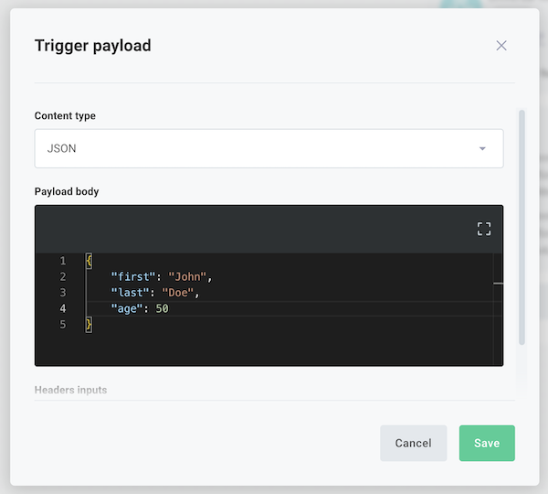
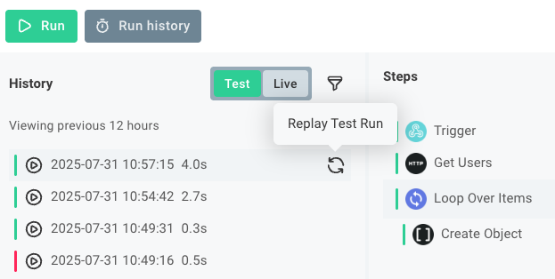

As you build your %WORKFLOW%, you can test it to ensure that it works as expected.
This article describes how to test your %WORKFLOW% within the %EMBEDDED_WORKFLOW_BUILDER%.

## The test runner drawer

The test runner drawer appears at the bottom of the %EMBEDDED_WORKFLOW_BUILDER% when you click **Test** or **Run history**.
Within the drawer, you can see the results of test runs of your %WORKFLOW% (both runs triggered by the **Test** button and runs triggered by a [webhook request](./triggering.md#what-is-a-webhook)).

## Running a test of your %WORKFLOW%

To run a test of your %WORKFLOW%, click the **Test** button at the bottom of the %EMBEDDED_WORKFLOW_BUILDER%.
This will open the test runner drawer and start a new test run of your %WORKFLOW%.
You can also click the **Run history** button to open the test runner drawer without starting a new test run.

### Running a test with a webhook request

If your %WORKFLOW% is triggered by a webhook request, you can run a test with a test payload in one of two ways:

1. Click the **trigger** of your %WORKFLOW% and then open the **Test** tab.
   Click the **Trigger Payload** button and specify a payload.
   The next time you click the **Run** button, the test run will use that payload as the webhook request.

   

2. In your trigger's **Test** tab, expand **Webhook URLs**.
   Your **Test URL** represents the webhook URL of your test %WORKFLOW% (the %WORKFLOW% you see in the %EMBEDDED_WORKFLOW_BUILDER%) and **Live URL** represents the URL of your workflow when you [enable](./enabling.md) it.

   Use a tool like [Postman](https://www.postman.com/) or [cURL](https://curl.se/) to send a POST request to your URL with a test payload.

## Test run results and logs

You can observe the results of your test runs in the test runner drawer.
Select a test run and then select a step of your %WORKFLOW% to see the results of that step.
You can also see the logs for each step, which can help you debug any issues that arise during the test run.

## Replaying test invocations

If your %WORKFLOW% relies on data sent from a third-party service, you can replay a test invocation to simulate the same data being sent again.
That way, you don't have to configure the third-party service to send the data again, and you can test how your modified %WORKFLOW% handles that same payload.

Mouse over the test invocation you'd like to replay and click the circular **Replay Test Run** arrow icon that appears.

